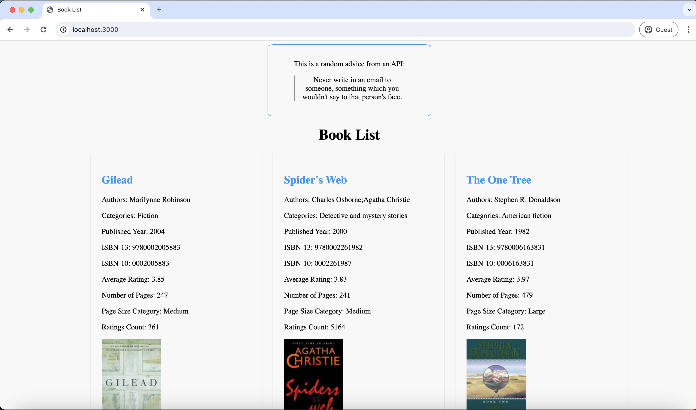

# Books app

Learn how to use the Performance API with Prometheus

**Tutorial**: [Node.js Performance Monitoring: A Beginners Guide
](https://betterstack.com/community/guides/scaling-nodejs/nodejs-performance-monitoring/)



## 🟢 Prerequisites

Ensure you have Node.js and npm installed on your machine.

## 📦 Getting started

- Clone this repository to your machine:

```bash
git clone https://github.com/betterstack-community/books-app
```

- `cd` into the project folder and run `npm install` to download dependencies.
- Execute the command below to start the development server:

```bash
npm start
```

- Visit `http://localhost:3000`
  in your browser to register the first user.

## ⚖ License

The code used in this project and in the linked tutorial are licensed under the [Apache License, Version 2.0](LICENSE).
